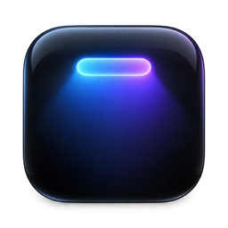

<p align="center">
  
</p>

<h1 align="center">SimpleNotch</h1>

<p align="center">
  Turn your MacBook's notch into a small workspace that's always there.<br>
  Media controls, a file shelf, clipboard history, window snapping, a Pomodoro timer, a translator and birthday countdowns, all behind one hover.
</p>

<p align="center">
  
  
  
</p>

<p align="center">
  <a href="https://github.com/Nurikexe/SimpleNotch/releases/latest/download/SimpleNotch.dmg"></a>
</p>

---

## Why

The notch is dead space in the middle of your menu bar. SimpleNotch makes it useful without adding clutter. Hover over it and it opens with a spring. Move away and it closes. When it's closed and nothing is running, it uses no CPU.

It's built on the design and animation of [boring.notch](https://github.com/TheBoredTeam/boring.notch) and adds the tools you'd otherwise install as five separate menu-bar apps.

## Features

### 🎵 Media
- Now-playing artwork, title and artist, with a live audio visualizer.
- Play/pause, skip and a scrubbable progress bar.
- Works with Apple Music, Spotify, YouTube Music and anything that reports Now Playing.
- Calendar events and Reminders sit next to the player.

### 📂 Shelf
- Drag files, folders, links or text onto the notch to keep them for later.
- Drag them back out to any app.
- Right-click an item to Open, Show in Finder, Copy, Share or Remove it.

### 📋 Clipboard history
- Keeps your last **50** copies: text, links, images and files.
- Pin the ones you want to keep.
- Press `⌘⇧V` to open it. Click an item to paste it into the app you were using.
- Content that password managers mark as concealed or transient is never saved.

### 🪟 Window snapping
- Drag any window toward the notch and a layout grid drops down. Release over a zone to snap the window there.
- Every layout also has a keyboard shortcut (see below).

### 🍅 Focus
- A Pomodoro timer with an animated cartoon tomato: 25 min focus, 5 min short break, 15 min long break after 4 sessions. All of these can be changed.
- Breaks start automatically. Focus sessions wait for you.
- A simple countdown timer, too.
- Progress glides around the closed notch, so you can see it without opening anything.

### 🌐 Translate
- English ↔ Russian translation on your Mac, using Apple's Translation framework.
- Select text anywhere and press `⌃⌥T`.

### 🎂 Birthdays
- Add people with a date and an emoji.
- See a countdown to each person's next birthday.

### Feel
- Every movement uses a spring and can be interrupted. Progress updates every frame, at up to 120 Hz on ProMotion displays.
- Respects **Reduce Motion**.
- No hover haptics.
- English and Russian interface.

## Keyboard shortcuts

You can change every shortcut in Settings.

| Action | Shortcut |
| --- | --- |
| Open / close the notch | `⌘⇧I` |
| Toggle sneak peek | `⌘⇧H` |
| Clipboard history | `⌘⇧V` |
| Translate selection | `⌃⌥T` |
| Maximise window | `⌃⌥↩` |
| Centre window | `⌃⌥C` |
| Left / right half | `⌃⌥←` / `⌃⌥→` |
| Top-left / top-right quarter | `⌃⌥U` / `⌃⌥I` |
| Bottom-left / bottom-right quarter | `⌃⌥J` / `⌃⌥K` |
| Left / centre / right third | `⌃⌥D` / `⌃⌥F` / `⌃⌥G` |
| Left two-thirds | `⌃⌥E` |

## Requirements

- A Mac running **macOS 15 Sequoia** or newer. It works best on a MacBook with a notch, and also works on displays without one.

### Permissions

SimpleNotch asks for a permission only when you first use the feature that needs it.

| Permission | Used for |
| --- | --- |
| Accessibility | Window snapping, pasting from Clipboard history, translating the selection |
| Calendars & Reminders | Showing upcoming events and reminders |
| Automation (Apple Events) | Controlling music apps |

SimpleNotch runs outside the App Sandbox, because moving other apps' windows and pasting into them isn't possible inside it. See [ADR 0003](docs/adr/0003-no-app-sandbox-developer-id.md) for the reasoning.

## Install

1. [Download the latest **SimpleNotch.dmg**](https://github.com/Nurikexe/SimpleNotch/releases/latest/download/SimpleNotch.dmg).
2. Open it and drag **SimpleNotch** into **Applications**.
3. Launch it, then hover over the notch.

> **First launch:** releases are not notarized by Apple yet, so macOS blocks the first open with *"SimpleNotch" cannot be opened*.
> Click **Done**, open **System Settings › Privacy & Security**, scroll down and click **Open Anyway** next to SimpleNotch. You only do this once.
>
> Or run this in Terminal: `xattr -dr com.apple.quarantine /Applications/SimpleNotch.app`

SimpleNotch updates itself through Sparkle. Older versions are on the [Releases](https://github.com/Nurikexe/SimpleNotch/releases) page.

## Building from source

```sh
git clone https://github.com/Nurikexe/SimpleNotch.git
cd SimpleNotch
open SimpleNotch.xcodeproj
```

Select the `SimpleNotch` scheme and run it. You need Xcode 26 or newer. Swift packages resolve on the first build. To sign with your own team, change the signing team in the target's *Signing & Capabilities*.

## Releasing

`scripts/release.sh` does the full release:
1. Archives the app.
2. Signs it with Developer ID.
3. Notarizes it.
4. Builds a drag-to-Applications `SimpleNotch.dmg`.
5. Writes the Sparkle `appcast.xml`.

`--no-notarize` skips step 3. `scripts/release.sh --publish` also creates the GitHub release `v<version>` with both files attached. The download link and the app's update feed always point at the latest release.

One-time setup:

1. Create a **Developer ID Application** certificate in *Xcode › Settings › Accounts › Manage Certificates*.
2. Store notarization credentials with an app-specific password:
   `xcrun notarytool store-credentials SimpleNotch --apple-id <apple-id> --team-id <team-id>`
3. Generate the Sparkle signing key with `build/DerivedData/SourcePackages/artifacts/sparkle/Sparkle/bin/generate_keys`. The key stays in your keychain. Add the printed public key to `SimpleNotch/Info.plist` as `SUPublicEDKey`.

## Project layout

- `CONTEXT.md` is the project's vocabulary.
- `docs/adr/` holds the architecture decisions.
- `CLAUDE.md` sets the motion standard that every animation must meet.

## Credits

SimpleNotch is a fork of **[boring.notch](https://github.com/TheBoredTeam/boring.notch)** by TheBoredTeam and its contributors. Its notch design, animations and media stack come from there.

Some feature ideas come from **[Cyclop](https://github.com/akalikbergenov/cyclop)** by akalikbergenov (MIT).

Third-party licenses are listed in [THIRD_PARTY_LICENSES](THIRD_PARTY_LICENSES).

## License

Like boring.notch, SimpleNotch is free software under the [GNU General Public License v3](LICENSE).
